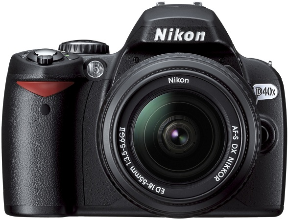

### jquery
Verifica su jQuery del 16/12/2020

All’avvio l’applicazione carica all’interno del contenitore elencoArticoli una preview delle
immagini di tutti gli articoli presenti nel database. La preview è strutturata nel modo seguente :

    

        
        
Nikon d19

    

* In corrispondenza del mouseover ogni immagine visualizza un tooltip giallo “Aggiungi al carrello”
* In corrispondenza del mouseover sull’immagine, sotto l’immagine viene visualizzato il suo nome
dell’articolo (esempio Canon c54)
* In corrispondenza del mouse out il nome viene nascosto
Dettagli
* Il contenitore dei dettagli è inizialmente nascosto
* In corrispondenza del click su un articolo viene visualizzato il contenitore dei dettagli tramite una
animazione di tipo slideDown della durata di 1 secondo.
All’interno del contenitore dei dettagli vengono visualizzati tutti i dettagli dell’articolo selezionato
(sovrascrivendo l’eventuale articolo precedente). Il contenitore dei dettagli è strutturato nel modo
seguente :
  

    

        
 
             X  
        

        

            
        

        

            <h4 class="item-title">Canon c430</h4>
            
Lorem ipsum 16 dolor sit amet, consectetur adipiscing elit. Mauris aliquet aliquam quam sit amet volutpat. Curabitur vel fermentum ipsum.

            
650$

            <button class="item-add">Aggiungi al carrello</button>
        

    

* In corrispondenza del click sul pulsante di chiusura, la finestra dei dettagli viene chiusa tramite una
animazione di tipo slideUp della durata di 1 secondo
Carrello
* In corrispondenza del click sul pulsante “ApriCarrello” viene visualizzato il carrello contenente gli
acquisti finora effettuati e viene modificata la scritta del pulsante in “ChiudiCarrello”.
Il codice della freccina rivolta verso l’alto è &#708. Il carrello viene aperto / chiuso mediante una
animazione slideDown / slideUp della durata di 1 secondo.
* In corrispondenza del click sul pulsante “Aggiungi al Carrello”, l’articolo corrispondente viene
aggiunto all’interno del carrello (indipendentemente dal fatto che il carrello sia visualizzato oppure
nascosto). Se l’articolo era già presente nel carrello viene semplicemente incrementata la quantità,
altrimenti viene creata una nuova riga
* Su ogni riga del carrello aggiungere l’immagine del cestino che, al click, consenta di eliminare l’intera
riga corrispondente

